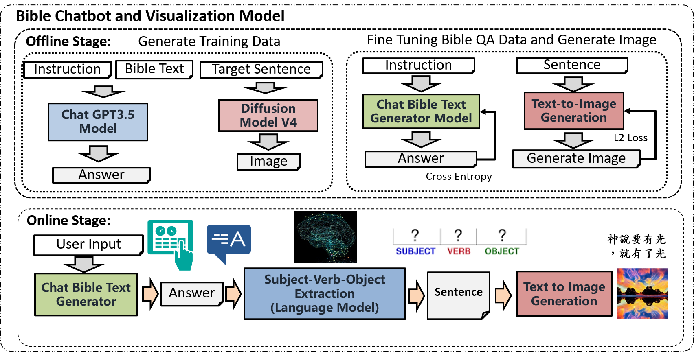
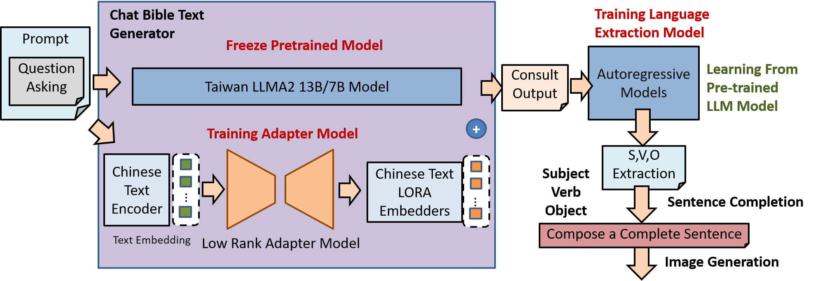
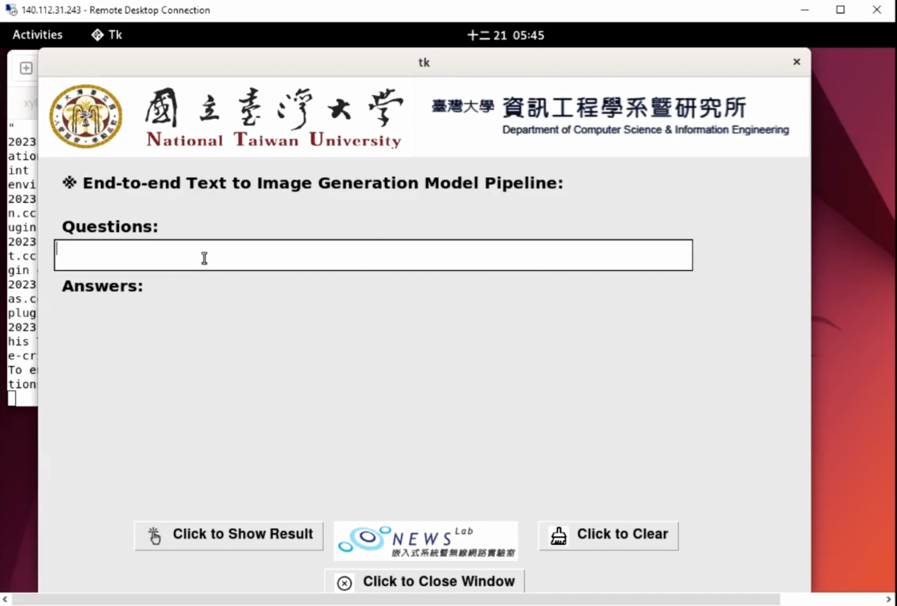

# NTU ADL Team11 Final

## Final_Project

This is a PyTorch implementation of Bible Chatbot with Visulize Image Generation Model.

### Description
Abilities: pray for you, preach, answer biblical question, provide spiritual insights on your situations(consult)

### Introduction
The figure shows the overall architecture of the Bible Chatbot and Scenario Generation Model.

The figure shows the text generation Chabot Architecture in first stage.

The figure shows the Image generation Architecture in second stage.

### Dependencies

sudo apt-get install pytorch torchvision torchaudio cudatoolkit=11.3
pip3 install accelerate==0.12.0 absl-py ml_collections einops wandb ftfy==6.1.1 transformers==4.23.1 loguru webdataset==0.2.5

### Data Preparation:

## For Biblechat model:

Use gpt-3.5-turbo,
prompting:
1. pray: would use new testiment books, psalms, proverbs
2. preach: all books
3. question answering: all books
4. consult: new testiment books

## For Image Generation model:
.
Since we used the freeze VQGAN Mode in a portion of our model for super resolution image generation,  we provide our pre trained modle on these task.

Download the VQGAN modlel weight from this link [], and put the unzip VQGAN in ./assets.

ImageNet:
ImageNet resize to 256x256: python3 extract_imagenet_feature.py /imagenet/path/on/local

CC3M:
First, prepare some context features for training by running python3 extract_test_prompt_feature.py and python extract_empty_feature.py
Next, prepare the webdataset using ptython3 feature2webdataset.py

### Training Text Generation Chabot

### Training Image generation Neural Network Model

### Inference with pretrain model

We Also provide a pre-trained checkpoints on ImageNet and CC3M.

### Inference Pipeline with User Interface

### Reference and Useful Links
1. bible source: http://cc.ee.ntu.edu.tw/~d01941025/bible/Materials.html