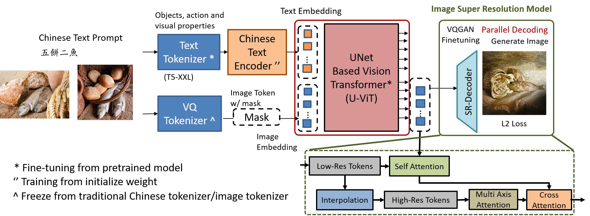

# NTU ADL Team11 Final

## Final_Project

This is a PyTorch implementation of Chinese Bible Chatbot with Visulize Image Generation Model.

The proposed model contains two different stage, the first stage is question answering model for answering input question and the second stage is image generation model for generating text scenario.

### Description
Abilities: pray for you, preach, answer biblical question, provide spiritual insights on your situations(consult)

**4 kinds of use case:**
**Question answering**: Use all books of bible. Given each question, answer a corresponding answer.

**Preach**: Use all books of bible. Given each input segment, the designed language model output a short preach. Basically performs content summarization and elaboration.

**Pray**: Use the new testament. Given each input segment and a situation, the design language model would pray for the user’s situation according to the bible segment.

**Counsel**: Use the new testament. Given each input segment and situation, he design language model would give some advice for the user’s situation according to the bible segment.

### Structure
```
NTU_ADL_Team11_Final/
├─ Bibel_Chatbot/           # Bible Chatbot Training Related Code
│  ├─ train_qlora.py
│  ├─ train_qlora_plot.py
│  ├─ ppl.py
│  ├─ private_zero_shot.py
│  ├─ private_few_shot.py
│  ├─ ...
│  ├─ public_zero_shot.py
│  ├─ private_few_shot.py
├─ Data_Generation/         # Bible Chatbot Language Model Generation Model
│  ├─ dataset/
│  ├─ utils/
│  ├─ gen_data.sh
├─ Demostration/            # End-to-end Inference Demostration Model 
│  ├─ text_to_image.py
│  ├─ context.py
│  ├─ ...
│  ├─ CSIE.png
├─ Text_to_Image/           # Image Generation Training Model 
│  ├─ open_clip/
│  ├─ taming/
│  ├─ timm/
│  ├─ tools/
│  ├─ web_img/
│  ├─ datasets.py
│  ├─ extract_empty_feature.py
│  ├─ extract_imagenet_feature.py
│  ├─ ...
│  ├─ train_t2i.py
├─ /Figure                  # Experiment Figure

```
### Introduction
The figure shows the overall architecture of the Bible Chatbot and Scenario Generation Model.


The training of Chinese text generation Chabot in first stage is in ```./Bible_Chatbot/``` folder.

The figure shows the text generation Chabot Architecture in first stage.


The training image generation and visulation part for second stage is in ```./Text_to_Image/``` folder.

The figure shows the Image generation Architecture in second stage.



### Dependencies
```
sudo apt-get install pytorch torchvision torchaudio cudatoolkit=11.3
pip3 install accelerate==0.12.0 absl-py ml_collections einops wandb ftfy==6.1.1 transformers==4.23.1 loguru webdataset==0.2.5
```


### Data Preparation:

#### Biblechat model:

Use GPT-3.5-turbo to generate the answer.

Different Prompting:

1. pray: would use new testiment books, psalms, proverbs
2. preach: all books
3. question answering: all books
4. consult: new testiment books

```
cd ./Data_Generation
bash ./gen_data.sh
```

#### Image Generation model:

Since we used the freeze VQGAN Mode in a portion of our model for super resolution image generation,  we provide our pre trained modle on these task.

Download the VQGAN modlel weight and the reference statistics for FID from this [link](https://drive.google.com/file/d/13S_unB87n6KKuuMdyMnyExW0G1kplTbP/view), and put the unzip VQGAN model in ```./assets``` and FID statistics ```.npz``` file in ```./assets/fid_stats```.

**ImageNet:**
ImageNet resize to 256x256: ```python3 ./extract_imagenet_feature.py /path/to/imagenet/on/local/device```

**CC3M:**
First, prepare some context features for training by running ```python3 ./extract_test_prompt_feature.py``` and ```python3 ./extract_empty_feature.py```
Next, prepare the webdataset using ```python3 ./feature2webdataset.py```


### Training/evaluation Text Generation Chabot


Download the Taiwan-LLM-7B-v2.0 pre-trained based model from this [link](https://drive.google.com/file/d/1VzSqlZpwfhNPBltGaFos6Vdst8u2r-2B/view?usp=sharing)

**Zero-shot Evaluation**

```
python3 ./private_zero_shot.py  # On private datasets
python3 ./public_zero_shot.py   # On public datasets
```
**Few-shot Evaluation**

```
python3 ./private_few_shot.py  # On private datasets
python3 ./public_few_shot.py   # On public datasets
```


**Qlora Fine-tuning on Bible Dataset**

```
python3 ./train_qlora.py       # Train the qlora model
python3 ./train_qlora_plot.py  # Plot the training curve
```


### Training/evaluation Image generation Neural Network Model

Download the pre-trained checkpoints from this [link](https://drive.google.com/file/d/1gVR8d0jOI1HOCDi8hHk7yRzDhEU_dL7O/view?usp=sharing) extract it into ```./Bible_Chatbot/assets/``` for zero shot evaluation or finetuning for on Bible image datasets.

**Zero-shot Evaluation**

```
export EVAL_CKPT="./assets/ckpts/imagenet256.ckpt"
export OUTPUT_DIR="assign/the/output_dir/"
mkdir -p $OUTPUT_DIR

accelerate launch --num_processes 8 --mixed_precision fp16 train_t2i.py --config=configs/imagenet256_base_vq_jax.py
```

**Fine-tuning on ImageNet 256x256**

```
export OUTPUT_DIR="set/the/output_dir/"
mkdir -p $OUTPUT_DIR

accelerate launch --num_processes 8 --mixed_precision fp16 train_t2i.py --config=configs/imagenet256_base_vq_jax.py
```


### Inference with pretrain model

We Also provide a pre-trained checkpoints on ImageNet and CC3M.

```
export EVAL_CKPT="./assets/ckpts/imagenet256-450000.ckpt"
export OUTPUT_DIR="output_dir/for/this/experiment"
mkdir -p $OUTPUT_DIR

accelerate launch --num_processes 8 --mixed_precision fp16 train_t2i.py --config=configs/imagenet256_base_vq_jax.py
```


### Inference Pipeline with User Interface

```
python3 text_to_image.py
```


### Demostration:

#### Question Answering
Use all books of bible. Given each segment, the model would answer the corresponding question.


#### Preach
Use all books of the bible. Given each segment, the model would give a short preach. It performs content summarization and elaboration


#### Pray
Given each segment and a generated situation, the model would pray for the user’s situation according to the bible segment.


#### Counsel
Given each segment and a generated situation, the model would advise the user’s situation according to the bible segment.


### Reference and Useful Links
1. Bible source: http://cc.ee.ntu.edu.tw/~d01941025/bible/Materials.html
2. Muse: Text-to-image generation via masked generative transformers https://arxiv.org/abs/2301.00704
3. Taiwan-LLM: https://github.com/MiuLab/Taiwan-LLM
4. ImageNet: A large-scale hierarchical image database: https://ieeexplore.ieee.org/document/5206848
5. Stable Diffusion: https://github.com/CompVis/stable-diffusion
6. LoRA: Low-Rank Adaptation of Large Language Models: https://arxiv.org/pdf/2106.09685.pdf
7. QLoRA: Efficient Finetuning of Quantized LLMs: https://github.com/artidoro/qlora
8. Taming Transformers for High-Resolution Image Synthesis: https://github.com/CompVis/taming-transformers


